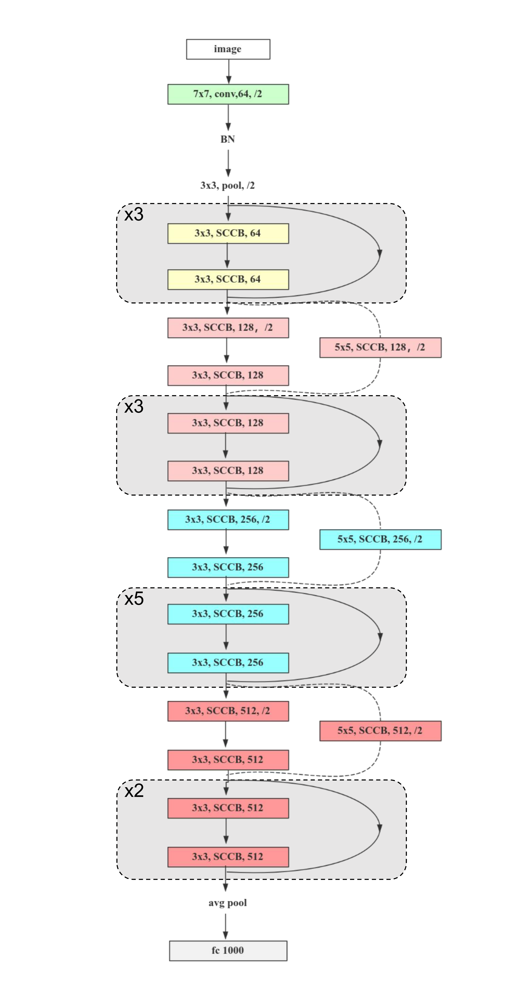

# Subspace Combination Convolutional Network For Image Classification

This repository contains PyTorch implementation for SCCNet .

## Introducing

While convolutional neural networks (CNNs) dominate real-time vision systems, their foundational limitations persist: linear convolution operations restrict nonlinear feature modeling, and static receptive fields hinder adaptation to spatially varying visual patterns. To fundamentally address these constraints, we propose ​​Subspace Combination Convolution (SCC)​​ – an innovative operator that intrinsically embeds adaptive nonlinear transformations and dynamic receptive field scaling within the convolution process.

Departing from activation-dependent nonlinearity approaches, SCC revolutionizes feature representation through dual synergistic mechanisms:

​​Spatially Specialized Kernel Partitioning​​: Convolutional kernels are decomposed into task-optimized subspaces for localized feature computation.
​​Feature-Guided Dynamic Recombination​​: Subspaces are adaptively recomposed under the guidance of local feature maxima.
This architecture delivers two breakthrough capabilities:
✓ ​​Dynamic Receptive Field Scaling: By reconfiguring weight subspaces, our method achieves dynamic receptive field adjustment within a single-branch architecture, yielding substantial gains in both performance and parameter efficiency.
✓ ​​Intrinsic Nonlinearity: The first nonlinear transformation that integrates activation functions with convolutional operators, eliminating the need for explicit activation layers and circumventing the output distribution shift induced by traditional standard convolution blocks.

Empirical validation across ImageNet-1k, CIFAR-10, and CIFAR-100 benchmarks demonstrates significant accuracy improvements, confirming SCC's superiority in modeling complex visual patterns while maintaining hardware efficiency.




# Model Comparison on ImageNet-1K

**SCCNet34 vs. ResNet34 Variants**

| Model             | Downsample  | Params   | GFlops (Theo) | Top-1 (%) | Top-5 (%) | URL |
|-------------------|-------------|----------|---------------|-----------|-----------|-----------|
| **ResNet34**      |             |          |               |           |           | |
|                   | Conv1x1     | 21.79 M  | 3.68          | 73.74     | 91.80     | |
|                   | Conv3x3     | 23.17 M  | 3.84          | 73.78     | 91.74     | |
|                   | Conv5x5     | 25.93 M  | 4.15          | 73.81     | 91.69     | |
| ResNet34+Mish     | Conv1x1     | 21.79 M  | 3.68          | 74.18     | 91.67     | |
| **SCCNet34**      |             |          |               |           |           | |
|                   | Conv1x1     | 21.84 M  | 4.07 (3.68)   | 74.08 (+0.34) | 91.83 (+0.03) | |
|                   | Conv5x5     | 25.98 M  | 4.07 (4.15)   | 74.13 (+0.39) | 91.71 (-0.09) | |
|                   | SCC 3x3     | 23.22 M  | 4.25 (3.84)   | 74.31 (+0.57) | 91.75 (-0.05) | |
|                   | SCC 5x5     | 25.98 M  | 4.73 (4.15)   | 74.85 (+1.11) | 92.06 (+0.26) | [huggingface](https://huggingface.co/Raven686/SCCNet/tree/main) |

**Key Observations**:
-GFlops values (baseline values in parentheses, actual SCCNet values outside parentheses)
-The +/- in Top-1/Top-5 accuracy indicates gains relative to the original ResNet34 Conv1x1 baseline
-The SCC 5x5 configuration achieved a significant improvement of ​​+1.11%​​ in Top-1 accuracy


## Usage

### Requirements

- torch
- torchvision
- setuptools<=70.0
- tensorboard
- six
- tqdm
- matplotlib


**Data preparation**: download and extract ImageNet1K images from http://image-net.org/. The directory structure should be

```
│ILSVRC2012/
├──train/
│  ├── n01440764
│  │   ├── n01440764_10026.JPEG
│  │   ├── n01440764_10027.JPEG
│  │   ├── ......
│  ├── ......
├──val/
│  ├── n01440764
│  │   ├── ILSVRC2012_val_00000293.JPEG
│  │   ├── ILSVRC2012_val_00002138.JPEG
│  │   ├── ......
│  ├── ......
```


### Training

To train SCCNet models on ImageNet from scratch, run:

```
python train.py --data-path /path/to/ILSVRC2012/
```

To finetune a pre-trained model, run:

```
python train.py --data-path /path/to/ILSVRC2012/ --weight checkpoints/flin1kp0.5ds5x-best.pth 
```
